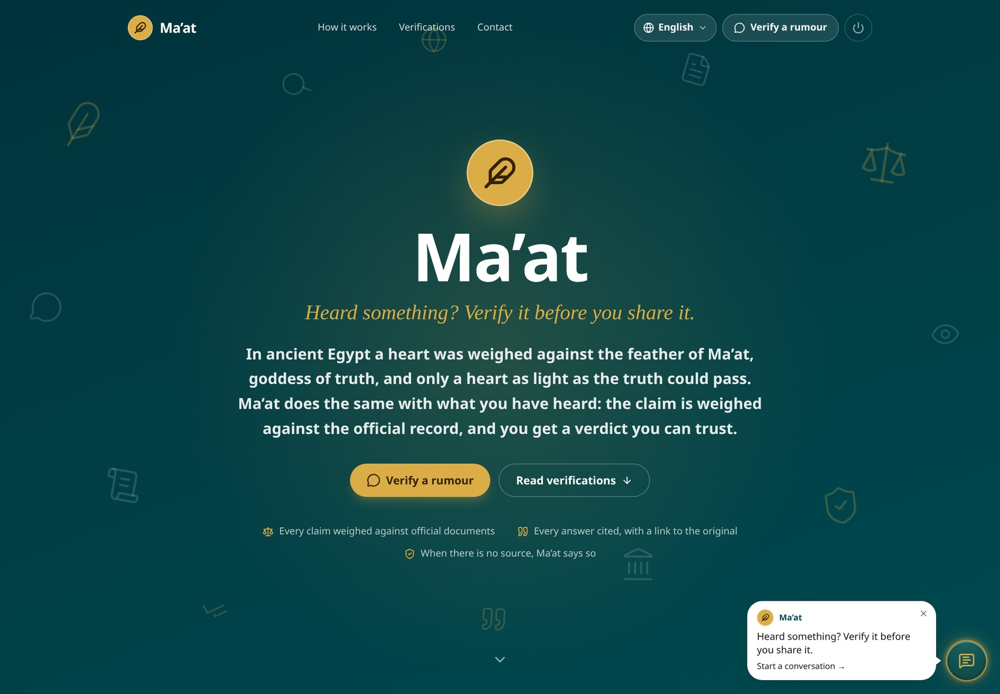

# Ma’at

[](https://github.com/hopeogbons/maat/actions/workflows/deploy.yml)

Ma’at checks a rumour against documents published by official bodies, answers in the user's language with the document cited, and says plainly when no verified source exists.

Built for the Andela × Open Society Foundations hackathon, Track 1: stability and social cohesion.

- **Live site:** https://maatverify.vercel.app
- **API:** https://maat-api.customersupport.ng/accounts/login/ (health check at `/api/health/`)
- **Demo video:** _link to come_



## The problem

In moments of tension, unverified rumours travel faster than corrections. A message about an attack, a curfew, a recall or an exam date reaches a neighbourhood in minutes. The statement that settles it arrives hours later, by which time people have acted on the rumour or taken sides over it. Ma’at gives the person who received the message a way to check it against what the relevant institutions have actually published, before passing it on.

## What it does

- A chat widget on the site (text or voice note) and a Telegram bot, both answered by the same engine.
- Reads the claim back, asks at most two follow-up questions (who, what, when, where), then weighs it.
- Three verdicts: **Verified**, **Unverified**, **Insufficient evidence**. It never calls anything false.
- Every verdict cites the document: issuing body, date, the exact sentence relied on, and a link to the original.
- A staff dashboard: rumours, conversations, sources, documents and settings.
- A rumour raised by enough different people (three, by default) becomes a public verification article.

## Architecture

```
claim ────► interview ────► retrieve ────► judge ────► confidence gate ────► answer, cited
text, voice   read back,      embedding       supports /      judgement ≥ 85          or
or Telegram   ≤ 2 questions   search over     contradicts /   (never similarity)      abstain
                              the record,     same subject /
                              reranked        unrelated
```

1. **Interview.** The message is read as data, never as instructions. The claim is extracted into a neutral paraphrase with its who, what, when and where; missing facts are asked for, at most two questions.
2. **Retrieve.** The claim, in English, is embedded and searched against the record (PostgreSQL with pgvector). The closest passages are reranked.
3. **Judge.** A second, more careful model reads each passage against the claim and returns one of four answers: supports, contradicts, same subject but settles nothing, unrelated. It also returns the exact sentence it relied on.
4. **Confidence gate.** Similarity and judgement are separate numbers. Similarity says whether two texts are about the same thing; it cannot tell agreement from contradiction. The gate (85 by default, editable in Settings) sits on the judgement only.
5. **Answer or abstain.** Supports above the gate is Verified. Contradicts above the gate is Unverified. Anything else is Insufficient evidence: Ma’at says the record does not settle it, shows the closest records with links so the reader can judge for themselves, and offers, only if the visitor says yes, to query the configured live sources.

| Part | What it is |
|---|---|
| `backend/` | Django 6, Django REST Framework, PostgreSQL + pgvector, gunicorn. Apps: `verification` (conversations, rumours, verdicts), `knowledge` (sources, documents, ingestion), `ai` (interview, judge, rerank, embeddings, speech), `telegram`, `appsettings`, `accounts`, `core` (ISO catalogues), `api`. |
| `frontend/` | Vite, React 19, TypeScript, Tailwind v4, shadcn/ui. The landing page, the widget and the dashboard. |
| Models | OpenAI, by role: `gpt-4.1-mini` for reading the visitor and the interview, `gpt-4.1` for judging and writing the answer, `text-embedding-3-small`, `gpt-4o-transcribe`, `gpt-4o-mini-tts`. All set by environment variable. |
| Hosting | Frontend on Vercel. Backend on a VPS behind nginx, deployed by GitHub Actions. |

## The source registry

A source is a body, the door its publications are read through, and a polling cadence. The doors, in order of preference:

| Door | Used when |
|---|---|
| Public API (including the WordPress REST API most public bodies' sites carry) | The site has one. Complete text, exact dates. |
| RSS or Atom feed | No API. Full text preferred; a summary-only feed still counts as the body's own words. |
| The body's own public pages | Neither API nor feed, and only for an official or public-interest body. Robots rules obeyed, identified user agent, one page at a time, whole articles only, nothing behind a login or paywall. |
| Direct upload | Bodies that publish files rather than a stream. |

The door is decided by probing the site (`manage.py discover_source`, or the **Add a source** form in the dashboard, which does the same), not by assumption. The register is `backend/knowledge/fixtures/register.json`, loaded with `manage.py seed_sources`; the dashboard's Sources page edits the same rows. The poller (`manage.py poll_feeds --loop`) fetches new documents at each source's cadence (six hours by default), then parses, chunks and embeds them.

### Adding a country

1. Register its bodies: rows in `register.json`, or the dashboard form.
2. Switch the country on in **Settings**.

That is the whole change. A country that is switched off costs nothing: it is not polled, not searched, not asked about and not shown, and its languages are off the picker. Nigeria is on. Kenya is registered and off until its sources have been checked. Interface translations are code (`frontend/src/i18n/locales/`), so a language that is new to the picker needs a locale file; the verification itself does not.

## Languages

| Country | Available now | Listed as coming soon |
|---|---|---|
| (shared) | English | |
| Nigeria | Hausa, Yorùbá, Igbo, Naijá (Nigerian Pidgin) | |
| Kenya | Kiswahili | Gĩkũyũ, Dholuo, Luluhya, Kalenjin, Kikamba, Af-Soomaali |

- The record is English. The claim is extracted into English, and retrieval and judgement run in English.
- The answer is written in the language the widget is showing. A voice note is transcribed with that language named, and the reply is spoken in it.
- A quoted sentence is shown as published, word for word, so the highlight matches the document. Its meaning in the visitor's language sits beside it. If that translation fails, the English stands alone: a missing translation is a gap, never an invented sentence.
- Interface strings live in `frontend/src/i18n/locales/<code>.ts`. Each file must implement the whole `Messages` shape, so a missing string fails the build instead of silently showing English.

## Running it from a clean clone

### Requirements

- Python 3.12 or newer
- Node 22 or newer
- PostgreSQL 15 or newer with the pgvector extension package installed (the first migration runs `CREATE EXTENSION vector`)
- An OpenAI API key, or `AI_OFFLINE=True` to run every AI call on its offline fallback
- Redis is not needed locally; production uses it for sign-in throttling

### Steps

```bash
git clone git@github.com:hopeogbons/maat.git
cd maat

# 1. Database: role "maat", password "maat", database "maat" (asks for sudo once)
backend/scripts/create_local_db.sh

# 2. Backend
cd backend
python3 -m venv .venv
.venv/bin/pip install -r requirements.txt
cp .env.example .env                          # set SECRET_KEY and OPENAI_API_KEY (or AI_OFFLINE=True)
.venv/bin/python manage.py migrate
.venv/bin/python manage.py createsuperuser    # the dashboard sign-in
cd ..

# 3. Seed the ISO catalogues, the source register and coverage for its countries
python3 scripts/dev_seed.py

# 4. Fetch documents once (add --loop to keep polling)
cd backend && .venv/bin/python manage.py poll_feeds && cd ..

# 5. Run, in two terminals
cd backend && .venv/bin/python manage.py runserver     # http://127.0.0.1:8000
cd frontend && npm install && npm run dev              # http://localhost:5173
```

If `migrate` fails on the vector extension, run `CREATE EXTENSION vector;` in the `maat` database as the postgres superuser once, then run `migrate` again.

Open http://localhost:5173. The landing page loads with the widget bottom-right (`?open` on the URL starts with it open). The Vite dev server proxies `/api/*` to Django, so no CORS setup is needed locally. The dashboard is at http://localhost:5173/dashboard; sign in there with the superuser account.

### Environment variables

Backend, in `backend/.env` locally and `/etc/maat.env` in production. Every setting is documented in `backend/.env.example`.

| Variable | Purpose |
|---|---|
| `SECRET_KEY`, `DEBUG` | Django. `DEBUG=True` only on your machine. |
| `ALLOWED_HOSTS` | Hostnames Django answers for. Production: `maat-api.customersupport.ng`. |
| `DATABASE_URL` | PostgreSQL connection string. |
| `CORS_ALLOWED_ORIGINS`, `CORS_ALLOWED_ORIGIN_REGEXES`, `CSRF_TRUSTED_ORIGINS` | The site's origin. Production: `https://maatverify.vercel.app`, plus a regex for Vercel preview deployments. |
| `FRONTEND_URL` | Where the sign-in and signed-out pages link back to. Production: `https://maatverify.vercel.app`. |
| `API_TOKEN_TTL_HOURS` | How long a dashboard sign-in lasts (12). |
| `OPENAI_API_KEY`, `OPENAI_MODEL`, `OPENAI_ANSWER_MODEL`, `OPENAI_RERANK_MODEL`, `OPENAI_EMBEDDING_MODEL`, `OPENAI_TRANSCRIBE_MODEL`, `OPENAI_SPEECH_MODEL`, `OPENAI_SPEECH_VOICE` | The models, by role. |
| `AI_OFFLINE` | `True` makes every AI call use its offline fallback. |
| `VOICE_NOTE_MAX_BYTES` | Voice notes larger than this are refused (5 MB). |
| `PUBLIC_API_URL`, `TELEGRAM_BOT_TOKEN` | The Telegram webhook. The token can be pasted in Settings instead. |
| `REDIS_URL` | Production cache for the sign-in throttle. |
| `SECURE_SSL_REDIRECT` | Only if nginx is not already redirecting to https. |

Frontend, in Vercel's project settings (or `frontend/.env.local` locally):

| Variable | Purpose |
|---|---|
| `VITE_API_BASE_URL` | Empty in development (the Vite proxy handles it). On Vercel: `https://maat-api.customersupport.ng`, no trailing slash. |

### Under the production hostname, locally

Browsers force https for every `vercel.app` address and refuse self-signed certificates there. To run the dev servers as `maatverify.vercel.app`, point the name at yourself and make a trusted certificate once:

```bash
echo "127.0.0.1 maatverify.vercel.app" | sudo tee -a /etc/hosts
sudo apt install -y mkcert libnss3-tools && mkcert -install
cd frontend && mkdir -p .certs
mkcert -cert-file .certs/dev.pem -key-file .certs/dev-key.pem maatverify.vercel.app localhost 127.0.0.1
cd .. && python3 scripts/dev_up.py      # backend :8765, frontend :5174 and the poller, detached
python3 scripts/dev_down.py             # stops them
```

`vite.config.ts` and `backend/scripts/dev_server.sh` pick up `.certs/dev.pem` automatically.

### Tests and checks

```bash
cd backend && .venv/bin/python manage.py test                        # needs CREATEDB on the role
cd frontend && npm run build                                         # type-check and production build
python3 scripts/dev_reset.py --yes && python3 scripts/dev_seed.py    # wipe and reseed the local database
cd backend && .venv/bin/python manage.py prune_raw_text --dry-run    # what the retention promise would delete today
```

## Deploying

One push to `main` deploys both halves, independently.

- **Backend, to the VPS** by `.github/workflows/deploy.yml`: the test suite runs against a pgvector PostgreSQL on the runner, then `backend/` is rsynced into a new release directory and activated with `release-maat`, which installs, runs `backend/deploy/hooks/`, migrates, flips the `current` symlink and restarts `gunicorn@maat` and `maat-poller`. The release is smoke-tested and rolled back on failure. The server side (the nginx site for `maat-api.customersupport.ng`, the poller unit, the `/etc/maat.env` template, the runbook) lives in the separate **vps-deploy-kit** project under `apps/maat/`.
- **Frontend, to Vercel** by Vercel's GitHub integration, with **Root Directory** set to `frontend` and `VITE_API_BASE_URL` set to `https://maat-api.customersupport.ng`. `frontend/vercel.json` rewrites client-side routes to `index.html`.

| Task | Where |
|---|---|
| Deploy | `git push` |
| Roll back the backend | `release-maat rollback` on the server |
| What is deployed | `release-maat status` |
| Any `manage.py` command in production | `release-maat manage <command>` |
| Settings | `/etc/maat.env`, then `sudo systemctl restart gunicorn@maat maat-poller` |

## How sources are selected

Ma’at repeats only what a reliable institution has published, and cites it. A source is chosen for who it is, not for how easy it is to read. The register holds two kinds of body:

- **Primary official records.** Ministries, departments and agencies; statutory regulators and commissions; state-owned bodies whose statements the public depends on; recognised humanitarian bodies such as the national Red Cross. Examples: NEMA, NCDC, NAFDAC, NCC, NERC and NIMC in Nigeria; NDMA, KEBS, the Central Bank and KEMRI in Kenya. A claim about what a body did or said is checked against that body's own publication.
- **Credible reporting.** The public broadcaster and the state news agency (NTA, Radio Nigeria and the News Agency of Nigeria; KBC in Kenya), and public-interest global platforms such as UN News and the Humanitarian Data Exchange. Their reports are admitted as their own words. The verdict card always names the body, so a reader can see when a verdict rests on a report of a statement rather than on the statement itself.

Never: private newspapers, television, radio, blogs or aggregators, and nothing behind a login, a paywall or a consent wall. Direct upload with the publisher's permission is the only exception.

Every candidate is probed before it is added. A site that blocks automated reading, rate-limits every request or serves an invalid certificate is left out, not worked around. Who qualifies is a staff decision made in the register; the reader will read any site it is pointed at, so the register is where the line is held.

## Limitations

- **It only knows what registered bodies have published.** Silence in the record gives Insufficient evidence, not a denial. Ma’at never says a rumour is false; Unverified means the record contradicts it.
- **Coverage is Nigeria.** Kenya's bodies are registered but switched off until their sources have been checked. No other country is covered.
- **Some important bodies are missing** because their sites cannot be read automatically: they block bots, rate-limit every request, serve an invalid certificate or publish nothing reachable. Among them are the Central Bank of Nigeria, the Nigeria Police Force, Kenya's Ministry of Health and its electoral commission.
- **There is a lag.** Sources are polled on a schedule, six hours by default. A statement published an hour ago may not be in the record yet. The live lookup narrows this, and only for configured sources and only with the visitor's consent.
- **Text and voice only.** It cannot examine images, videos or screenshots, which is how many rumours travel.
- **Claims no institution would publish on** cannot be settled: private individuals, local incidents that drew no official statement, predictions, opinions.
- **The judgement is a model's reading of a passage.** The gate lowers the error rate; it does not remove it. The quoted sentence and the link to the original are there so the reader can check.
- **Translations are unreviewed.** The interface strings were machine-written and have not been checked by native speakers. Answers in those languages are model-written.
- **Limits by design.** Twenty questions per visitor per hour and two thousand a day across everyone. A rumour is answered privately until three different people have raised it. A visitor's own words are kept for thirty days, then only the neutral paraphrase remains.

## How AI coding tools were used

- **Claude Code** (Anthropic's command-line agent) was the main development tool throughout. Working from Hope Ogbons's instructions, most of them dictated by voice, it wrote most of the code in both halves, the tests, the migrations, the deploy scripts, the interface translations, the internal handbook and this README, in small steps that were reviewed as they landed.
- **The decisions came first and were written down before code.** The three verdicts and the refusal to say "false"; the confidence gate on judgement rather than similarity; the four doors and who qualifies for them; the coverage switch; the palette with no red anywhere. The tool implemented those decisions; it did not make them.
- **Checking the output.** The backend test suite runs before every deploy. Changes were exercised by hand against real rumours; the NIMC Act 2026 example on the dashboard is one of them.
- **Known gaps from working this way.** The translations have not been reviewed by native speakers, and the sample verification articles on the landing page are placeholder content.
- At runtime the product itself calls OpenAI models, by role, as listed under Architecture. That is separate from the tools used to build it.

## Project layout

```
maat/
├── backend/
│   ├── accounts/       sign-in pages and the dashboard's token auth
│   ├── ai/             interpreter, interview, judge, rerank, embeddings, translate, speech
│   ├── api/            root API routes, health, dashboard summary
│   ├── appsettings/    Settings: coverage, thresholds, rate limits, retention
│   ├── core/           ISO catalogues: countries, states, currencies, time zones
│   ├── deploy/         release hooks and the deploy notes
│   ├── knowledge/      sources, documents, chunks, the four doors, the poller
│   ├── telegram/       the Telegram webhook
│   └── verification/   conversations, rumours, verdicts, publication
├── frontend/src/
│   ├── dashboard/      the staff dashboard
│   ├── i18n/           languages, translations, the language store
│   ├── landing/        the public site
│   ├── lib/api.ts      fetch wrapper for the API
│   └── widget/         the chat widget
└── scripts/            dev_up, dev_down, dev_seed, dev_reset
```

## Frontend notes

- **The widget** (`frontend/src/widget/`) is a floating chat panel: 380 px wide on desktop with a maximise control, full screen on phones. Its Tailwind utilities are prefixed (`maat:`), generated only from files under `src/widget/`, and emitted with `!important`; a scoped reset under `.maat-root` replaces preflight, so it drops onto any page without touching it. Any element can open it with `window.dispatchEvent(new CustomEvent('maat:open'))`.
- **The landing page** (`frontend/src/landing/`): the hero, how it works, the verification articles and the footer. Contact details, social handles and nav links live in `src/landing/site.ts` and are placeholders. Sample articles in `src/landing/data/articles.ts` are placeholder content.
- **Sign in** goes to Django's own login page at `/accounts/login/`, restyled to match the site (teal, gold feather, amber error state, nothing red). `FRONTEND_URL` is where its logo and "Back to the site" link.
- **Palette.** Deep teal with a warm gold accent. Verdicts are muted green (verified), amber (unverified) and grey (insufficient evidence). Nothing is red.
